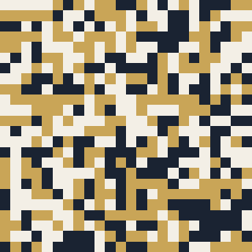

# genetic-avatar

My GitHub avatar, evolved. A genetic algorithm reconstructs my profile photo as a 24x24 grid of squares restricted to the three colours of my CV (ink, gold, paper). The evolutionary engine is the one we wrote for the Computational Intelligence for Optimization course project at NOVA IMS, where it reconstructed Girl with a Pearl Earring with semi-transparent triangles; here the representation changes and the target is my own face.



## How it works

- Representation: one gene per grid cell, 576 genes in [0, 1], each quantised at render time to one of the three palette colours
- Fitness: RMSE between the rendered grid and the photo downscaled to 24x24
- Selection: tournament of 5 with coin-flip tie-breaking; elitism 5%
- Variation: uniform crossover swapping whole cells (rate 0.8), Gaussian mutation N(0, 0.4) at rate 0.02. The sigma is larger than in the course project because genes must jump between discrete palette bins
- Budget: population 200, 1000 generations, seed 42, about 17 seconds on a laptop CPU

The global optimum of this formulation is the nearest-colour quantisation of the photo, so the interesting part is watching the population find it: `outputs/evolution.gif` goes from noise to a face.

## Run

```bash
pip install -r requirements.txt
python evolve_avatar.py
```

Outputs land in `outputs/`: the avatar (`avatar_800.png`), the fitness history and the evolution GIF. Point it at your own photo by replacing `data/target.jpg` and adjusting `PALETTE` in `src/config.py`.

## Credit

GA core written with Gonçalo Bento, Filipe Carmo and Marta La Feria for the CIFO course project (NOVA IMS, MSc Data Science and Advanced Analytics, 2025/26).
